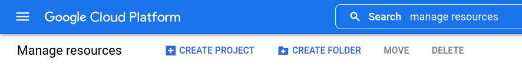
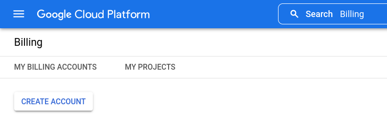
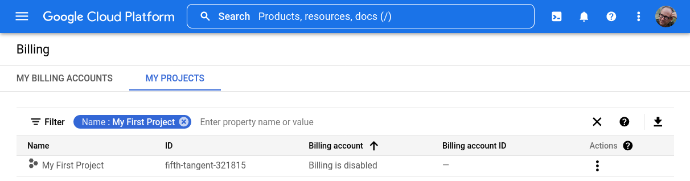
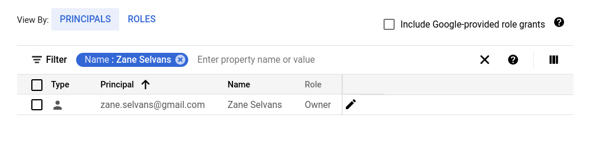
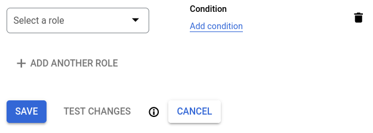
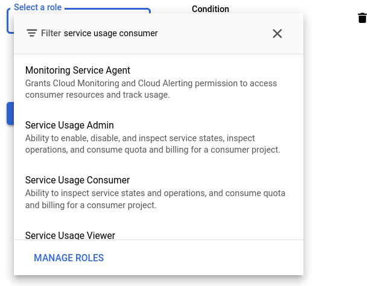
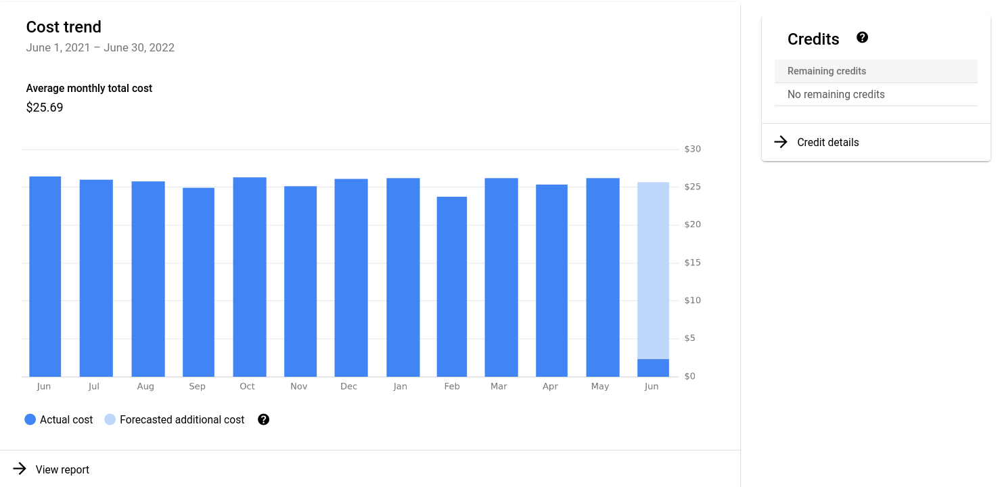
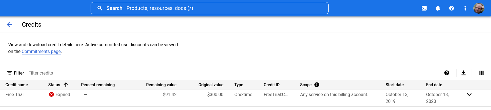

=======================================================================================
Accessing Public Cloud Data with Requester Pays
=======================================================================================

The data we're publishing in the PUDL Catalog is publicly accessible and distributed
under the permissive `CC-BY-4.0 <https://creativecommons.org/licenses/by/4.0>`__
license. Catalyst covers the cost of storing the data in Google cloud storage buckets.
However, there are also fees incurred when data leaves the Google Cloud Platform (GCP).
Depending where you're downloading from, it costs $0.10-0.20 (USD) per GB.  In order to
share large amounts of public data without risking unexpectedly large data egress
charges due to someone maliciously or accidentally downloading a large volume of data,
we've set our cloud storage to use `requester pays
<https://cloud.google.com/storage/docs/requester-pays>`__.

"Requester pays" means the person downloading the data is responsible for those costs
instead. As a user, the cost of a single download is cheap. But as a data provider,
payihg for the downloads of all users can quickly get expensive! Downloading all of the
EPA CEMS, FERC 1, PUDL, and US Census data we're publishing from North America should
cost about $0.75, but if we had 1000 downloads in a month that would cost us $750. The
PUDL Intake catalog is also set up to try and cache the data locally so that it's not
downloaded again until a new version is released.

Setting up a GCP project for billing
------------------------------------

The following instructions assume you don't currently have GCP set up, and just want to
be able to use public data that uses requester pays. If your organization already uses
GCP or you want to access the PUDL Catalog in the context of another project that's
running on GCP, you'll probably need to do something different.

Create a GCP Account
~~~~~~~~~~~~~~~~~~~~

If you have never used GCP before, go to `<https://cloud.google.com>`__ and click on the
"Get Started for Free" button.  A prompt should appear asking you to choose which Google
account to use for your GCP-related activities. You should be able to log in with a
Gmail account or another Google ID. You don't need to use Gmail for your email. Your
Google ID is just used for identification and authentication.

.. note::

  If you already have a GCP account set up then you can just log in to your existing
  account. Note that the free startup credits are only available for brand new accounts.

Create a New GCP Project
~~~~~~~~~~~~~~~~~~~~~~~~

GCP allows you to organize services, access, and billing under various Projects, which
you name and define. In the context of accessing public requester pays data, the only
thing it needs to do is identify who you are, and how you'd like to pay for any charges
associated with the accessing the data. These charges are from Google. Catalyst doesn't
charge a markup or get any money from this, it's just a way to help cover the costs of
distributing the data.

.. note::

  If you have a pre-existing GCP project that you want to use the PUDL Catalog within,
  you can skip this step.

Let's create a project for use in accessing public data.  Here's the
`GCP documentation on creating a new project
<https://cloud.google.com/resource-manager/docs/creating-managing-projects#creating_a_project>`__

After you've logged in, at the top of the main GCP home page you should see a search
field. Type in "Manage Resources" and at the top of the suggested searches that pop up
you should see a "Products and Pages" section, which contains "Manage Resources". Click
on that section, and you should come to the Manage Resources page.

Click on the "Create Project" link near the top of the page:

The only field you need to have filled in here is the Project Name. You can use the
random one that is suggested by Google. If you're creating a project outside of any
organization, it needs to be globally unique, so Google picks a couple of random words
and a random number (e.g. ``aerobic-star-352200``).

Create a GCP Billing Account
~~~~~~~~~~~~~~~~~~~~~~~~~~~~

The billing account is separate from the project you just created. See the
`GCP docs on creating a billing account <https://cloud.google.com/billing/docs/how-to/manage-billing-account#create_a_new_billing_account>`__
and navigate to `<https://console.cloud.google.com/billing>`__. At the top of the page
you should see a "Create Account" button.

.. note::

  If you have a pre-existing GCP Billing Account that you want to use to cover the cost of
  downloading data, then you can skip this step.

Enable billing on your project
~~~~~~~~~~~~~~~~~~~~~~~~~~~~~~

Now you need to associate the billing account you just created with the project you
made in the previous step. You need to `enable billing for the project
<https://cloud.google.com/billing/docs/how-to/modify-project#enable_billing_for_a_project>`__
through this account.

.. note::

  If you are using a pre-existing Billing Account and Project, you might still need to
  associate them with each other if they haven't been used together previously.

At the top of the `billing page <https://console.cloud.google.com/billing>`__ there
should be two tabs: "My Billing Accounts" and "My Projects". Select "My Projects" and
then in the row for the new project you created above, click on the three dots in the
far righthand column labeled "Actions". The menu that pops up should have an
"Add Billing" or "Change Billing" option. Click on that, and you should be given the
choice of which billing account to associate with the selected project.

Give yourself permission to spend
~~~~~~~~~~~~~~~~~~~~~~~~~~~~~~~~~

Finally, you need to give yourself (your Google ID) the power to spend money within
the new project, using the billing method you just specified. See these instructions
for `Using Google Cloud IAM <https://cloud.google.com/iam/docs/granting-changing-revoking-access#granting-console>`__
(Identity and Access Management), and navigate to the
`IAM Admin page <https://console.cloud.google.com/iam-admin/iam>`__.

Your Google ID (email address) should be listed as a "Principal" and you need to grant
that Principal the "Role" of **Service Usage Consumer**, which enables it to make
billed requests on the behalf of the currently selected project (which should be the
one you created at the beginning of this process -- the project should be visible in the
dropdown menu near the upper-left corner of the page).

Click on the little pencil icon in the right column of the row associated with your
Google ID to "edit principal".

This should give you the option to associate a role with a particular combination of
Principal and Project.

Click on the "Role" field and type in "Service Usage Consumer"
and it should filter the very long list of available roles down to a few, one of which
is "Service Usage Consumer". Select that role, and click on the Save button.

Check your GCP credit
~~~~~~~~~~~~~~~~~~~~~
Google provides new accounts with $300 in free credits so you can experiment a bit
without spending any of your own money. Check out the
`docs on the free trial period <https://cloud.google.com/free/docs/gcp-free-tier>`__
to understand how it works.

To check in on your remaining credits or overall billing status you can go to the
Billing Account Overview and click on the "Credit details" link in the Credits box on
the right hand side of the page:

This will show you a table of any existing GCP credits that have been granted to your
account:

Set up the Google Cloud SDK
---------------------------

Now that you have a GCP project with billing enabled, and your Google ID is empowered to
make use of it, you need to install software that allows your computer to communicate
with GCP and make authenticated requests on your behalf. This is part of the Google
Cloud software Development Kit (SDK).

Install the `gcloud utilities <https://cloud.google.com/sdk/docs/install>`__ on your
computer. There are several ways to do this. We recommend using ``conda`` or its faster
sibling ``mamba``, since you'll likely be using this catalog in the context of an
existing conda environment. If you're not using `conda` environments, there are other
ways to install the Google Cloud SDK explained in the link above.

.. code::

  conda install -c conda-forge google-cloud-sdk

Log into the account you used to create your new project above by running:

.. code::

  gcloud auth login

Initialize the ``gcloud`` command line interface and select the project you just created
as the default project. This allows the project to be used for requester pays access
through the command line or in software (like an Intake catalog) that has access to
shell environment variables.

If it asks you whether you want to "re-initialize this configuration with new settings"
say yes.

.. code::

  gcloud init

Finally, use ``gcloud`` to establish application default credentials; this will allow
the project to be used for requester pays access through applications:

.. code::

  gcloud auth application-default login

To test whether your GCP account is set up correctly and authenticated you can run the
following command to list the contents of the cloud storage bucket containing the PUDL
catalog data. This doesn't actually download any data, but will show you the versions
that are available:

.. code::

   gsutil ls gs://intake.catalyst.coop

.. code::

   gs://intake.catalyst.coop/dev/
   gs://intake.catalyst.coop/v0.1.0/

Every night we attempt to build a new catalog based on the code and data associated with
the ``dev`` branch of the PUDL repository. If the nightly build and data validation
succeed, the outputs are copied to ``gs://intake.catalyst.coop/dev``. To see what's
available there, how fresh it is, and how big the files are, you can use ``gsutil``
like this:

.. code::

   gsutil ls -l gs://intake.catalyst.coop/dev

    843649024  2022-09-15T12:27:02Z  gs://intake.catalyst.coop/dev/censusdp1tract.sqlite
    761257984  2022-09-15T12:27:04Z  gs://intake.catalyst.coop/dev/ferc1.sqlite
   5110330869  2022-09-15T12:28:59Z  gs://intake.catalyst.coop/dev/hourly_emissions_epacems.parquet
    702459904  2022-09-15T12:27:01Z  gs://intake.catalyst.coop/dev/pudl.sqlite
                                     gs://intake.catalyst.coop/dev/hourly_emissions_epacems/
   TOTAL: 4 objects, 7417697781 bytes (6.91 GiB)

.. warning::

   If you download the files directly with ``gsutil`` then you'll be responsible for
   updating them, making sure you have the right version, putting them in the right
   place on your computer, etc. You also won't benefit from the caching that the Intake
   catalogs do. For easier automatic updates, data versioning and dependency management,
   we recommend using the Intake catalog rather than direct downloads. But for
   developent work it can often be convenient to grab the fresh nightly build outputs.

If you want to copy these files down directly to your computer, rather than using the
PUDL Intake catalog, you can use the ``gsutil cp`` command, which behaves very much like
the Unix ``cp`` command:

.. code::

   gsutil cp gs://intake.catalyst.coop/dev/pudl.sqlite ./

If you wanted to download all of the build outputs (more than 10GB!) you could use ``cp
-r`` on the whole directory:

.. code::

   gsutil cp -r gs://intake.catalyst.coop/dev/ ./

For more details on how to use ``gsutil`` in general see the
`online documentation <https://cloud.google.com/storage/docs/gsutil>`__ or run:

.. code::

   gsutil --help
